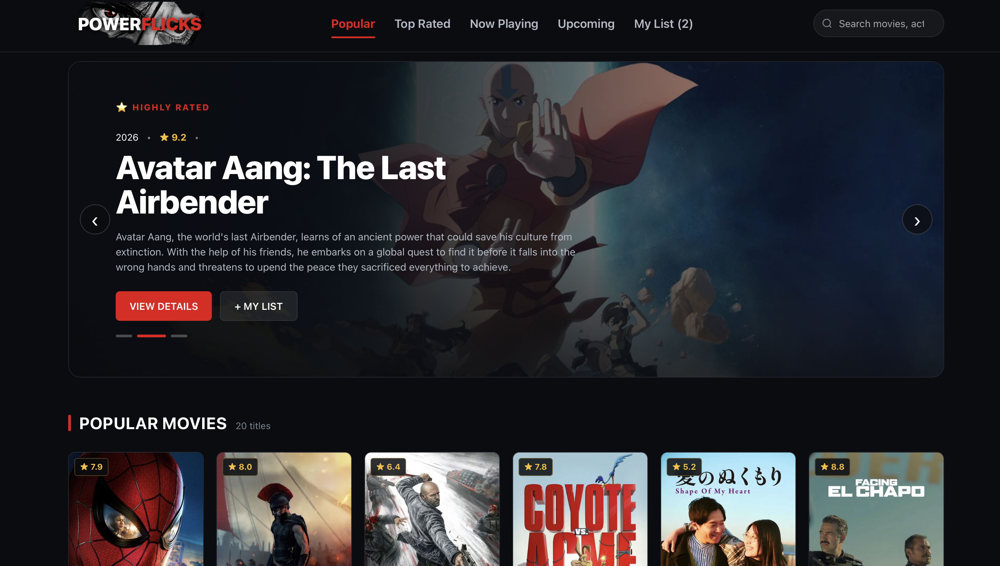
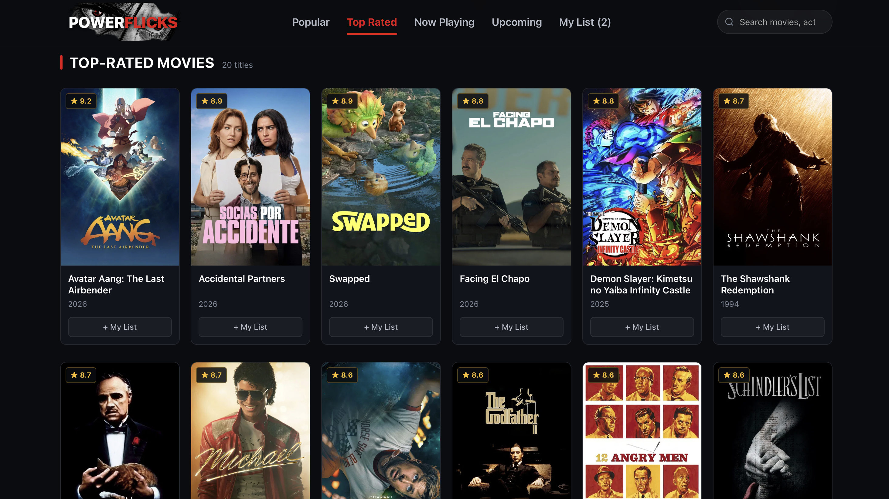
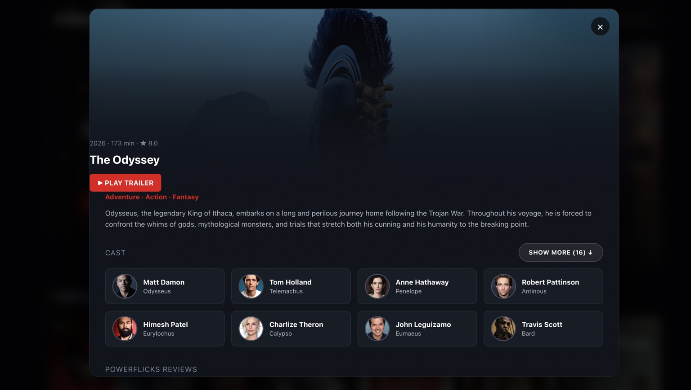
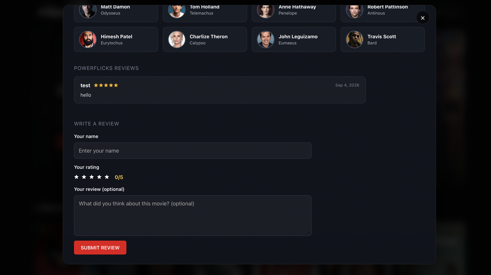
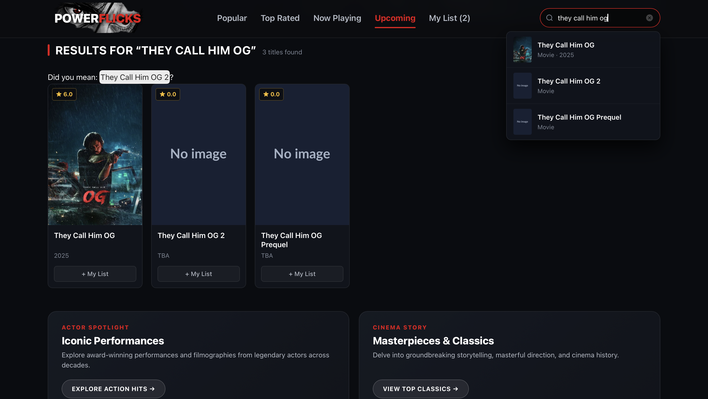
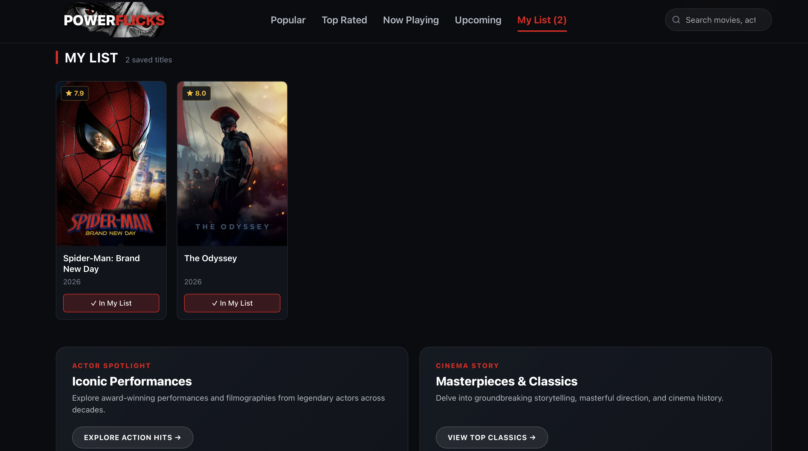

# PowerFlicks

### A modern movie discovery platform built with Flask, JavaScript, SQLite, and the TMDB API.

PowerFlicks is a full-stack movie discovery web application designed to make finding movies more engaging and personalized.

It combines live movie data from TMDB with search, discovery, movie details, recommendations, watchlists, community reviews, ratings, and movie-personality features in a single interface.

---

## Links

- **Live Demo:** https://powerflicks-movie-recommendation-website.onrender.com
- **GitHub:** https://github.com/yepuriakash/PowerFlicks--Movie-Recommendation-Website

---

## Screenshots

### Home & Movie Discovery

### Top Rated Movies

### Movie Details

### Community Reviews

### Search & Discovery

### My List

---

## Project Overview

PowerFlicks was built as a full-stack movie discovery application with a focus on combining a polished frontend experience with a backend that handles external API communication and persistent user data.

The application retrieves current movie information from the TMDB API while keeping the API credential on the server rather than exposing it to browser-side JavaScript.

The Flask backend also provides application-specific API routes for features such as watchlists and community reviews, with SQLite providing local data persistence.

---

## Key Features

- Movie discovery using current TMDB data
- Movie search and discovery
- Movie ratings and popularity information
- Detailed movie information and cast
- Movie recommendations
- Personal movie watchlist / My List
- Community movie reviews
- User-submitted review ratings
- Movie personality / birthday spotlight features
- Dynamic posters and backdrops
- Backend caching for frequently requested TMDB data
- Server-side API credential handling
- Input validation
- SQLite-backed persistent application data
- Responsive movie-focused interface

---

## How PowerFlicks Works

PowerFlicks uses a backend-first architecture.

The browser communicates with the Flask backend instead of directly communicating with TMDB.

### Request Flow

1. The user interacts with the PowerFlicks frontend.
2. JavaScript sends requests to the Flask backend.
3. Flask communicates with the TMDB API when external movie data is required.
4. Application-specific data such as watchlists and reviews is handled through the backend.
5. SQLite provides local persistence for application data.
6. The backend returns the required data to the frontend.
7. JavaScript dynamically renders the movie interface.

---

## Architecture

                         +--------------+
                         |     User     |
                         +------+-------+
                                |
                                v
                     +--------------------+
                     | PowerFlicks        |
                     | Frontend           |
                     | HTML / CSS / JS    |
                     +---------+----------+
                               |
                               v
                     +--------------------+
                     | Flask Backend      |
                     |      app.py        |
                     +---------+----------+
                               |
                  +------------+------------+
                  |                         |
                  v                         v
        +------------------+       +------------------+
        | TMDB API         |       | SQLite Database  |
        |                  |       |                  |
        | Movies           |       | Watchlist        |
        | Cast             |       | Reviews          |
        | Search           |       | Ratings          |
        | Recommendations  |       |                  |
        +------------------+       +------------------+

## Tech stack

| Technology | Purpose |
|---|---|
| **Python** | Backend programming |
| **Flask** | Web framework and API layer |
| **JavaScript** | Frontend logic and dynamic UI |
| **HTML5** | Application structure |
| **CSS3** | Styling and responsive interface |
| **SQLite** | Persistent application data |
| **TMDB API** | Movie, cast, ratings, and recommendation data |
| **Render** | Application deployment |
| **GitHub** | Source control and project hosting |

## Engineering Highlights

Backend-First API Architecture
Instead of allowing browser-side JavaScript to communicate directly with TMDB, PowerFlicks routes external API communication through Flask.
This provides a cleaner separation between the frontend and backend while keeping sensitive configuration on the server.
API Credential Protection
The TMDB API credential is stored as an environment variable and accessed by the Flask backend.
The credential is therefore not embedded directly into the frontend JavaScript.
Backend Caching
Frequently requested TMDB information can be cached by the backend to reduce unnecessary external API requests and improve application responsiveness.
Persistent Application Data
SQLite is used to persist application-specific information such as watchlists and community reviews.
Dynamic Frontend
The frontend uses JavaScript to dynamically update movie cards, search results, movie details, recommendations, reviews, and watchlist content without requiring a full page reload for every interaction

## Security & API Handling
PowerFlicks follows a backend-mediated API architecture
Browser
   |
   | Request
   v
Flask Backend
   |
   | API credential stays here
   v
TMDB API
The TMDB API credential is kept on the server and configured through environment variables.

For local development, create a .env file based on .env.example.

Never commit real API credentials or secrets to GitHub.

## Project Structure
PowerFlicks--Movie-Recommendation-Website/
|
├── app.py
├── requirements.txt
├── Procfile
├── .env.example
├── .gitignore
├── LICENSE.txt
├── PowerFlicks.db
├── powerflix.db
|
├── static/
│   ├── index.html
│   ├── style.css
│   ├── app.js
│   └── images/
|
└── screenshots/
    ├── home.png
    ├── top-rated.png
    ├── movie-details.png
    ├── reviews.png
    ├── search-results.png
    └── my-list.png

## Local Setup
1. Clone the repository
git clone https://github.com/yepuriakash/PowerFlicks--Movie-Recommendation-Website.git
cd PowerFlicks--Movie-Recommendation-Website

2. Create a virtual environment
Windows
python -m venv venv
venv\Scripts\activate

Macos
python3 -m venv venv
source venv/bin/activate

3. Install dependencies
pip install -r requirements.txt

4. Configure the TMDB API
Create a .env file in the project root.

Use .env.example as the template.

Add your TMDB API credential:
TMDB_API_KEY=your_api_key_here

5. Run the application
python app.py
The application will be available locally at:
http://localhost:5000

## Deployment
PowerFlicks is deployed using Render.

The production deployment runs the Flask application using the project’s Procfile and configured environment variables.

Production Environment

The TMDB API credential should be configured through the deployment platform’s environment variables rather than committed to the repository.

## Future Improvements
Potential future improvements include:

* User authentication and individual accounts
* More advanced personalized recommendations
* Genre and mood-based discovery
* Streaming availability information
* Personalized movie notifications
* User movie statistics and viewing history
* More location-aware movie and cinema information
* Further frontend performance optimization
* Enhanced mobile experience

## License

This project is licensed under the terms specified in LICENSE.txt⁠.

## Author

Akash Chandra Yepuri

Built as a full-stack movie discovery project combining frontend engineering, backend API development, database persistence, and third-party API integration.

